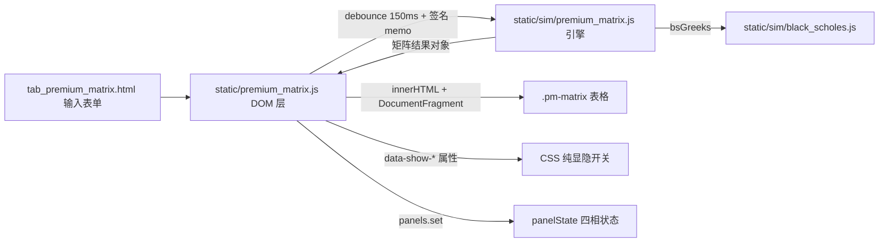

## 产品概述

在现有 Dashboard 中新增一个**独立的「溢价率矩阵（Premium Matrix）」Tab**：一个不依赖任何真实行情数据的期权溢价率速查工具。用户只输入标的现价、隐含波动率、无风险利率与买卖价差，页面即时生成一张矩阵表，横轴为到期天数，纵轴为行权价，每个格子左右分栏同时给出认购与认沽的**期权价格**与**溢价率**（达到盈亏平衡所需的标的涨跌幅），并可用右上角开关自由组合显示内容。

## 核心功能

- **四项输入**：Price（默认 100）、IV%（默认 25）、Risk-free%（默认 3）、Spread%（默认 0，即成交价=BS 理论中价）；不接入任何真实股票价格数据。
- **成交价口径**：mid 由 Black-Scholes 计算；买方视角成交价 = mid×(1+spread/200)，卖方视角 = mid×(1−spread/200)，两种视角共用同一套溢价率公式。
- **横轴（Dates）**：DTE 1–90，每 5 天一档（1, 6, 11, …, 86，共 18 列）；列头显示 DTE 及该列的 1σ 位移（价格与百分比）。
- **纵轴（Strike / Sigma）**：行权价覆盖现价 ±20%，最小间隔 1、四舍五入取整、去重升序；行头显示 Strike 与该行在「当前列」下的 σ 倍数（默认取最接近 30D 的列，hover/focus/下拉切换时仅刷新行头数字）。
- **单元格**：左半 Call、右半 Put，每半格两行数字（期权价格、溢价率）；平值行高亮，行头列头吸顶吸左，可横纵向滚动。
- **显示开关**：面板右上角四个独立开关——显示期权价格 / 显示溢价率 / 显示 Call / 显示 Put；切换为纯 CSS 显隐，零重算；全部关闭时给出引导空状态。
- **视觉与状态**：遵循既有 P1–P5 契约（hero 主指标、KPI 条、idle/loading/loaded/empty|error 四相状态、语义色不复用、焦点环与 aria 标签齐全）。

## 非 MVP 范围（后续迭代）

后端 `core/` 镜像与 golden 对拍、热图着色、CSV 导出、参数本地记忆、多档 IV 对比、GitHub Pages 静态页同步。

## 技术栈

- 沿用既有前端栈：Flask + Jinja2 模板 + Alpine（`x-data="panelState('premium_matrix')"`）+ 原生 JS，无构建步骤、无 React/Vue（ADR 0006 约束）。
- 计算引擎：`static/sim/` 下的 ES Module（与 `grid.js`/`black_scholes.js` 同层，零 I/O、Pages 安全），直接复用 `black_scholes.js::bsGreeks`。
- 渲染层：`static/premium_matrix.js`（IIFE，与 `simulation.js`/`regime.js` 同风格），通过 `window.appState.panels.set()` 驱动四相状态。
- 样式：复用 `static/styles.css` 既有 token 与 `.sim-matrix` / `.metric-hero` / `.kpi-card` / `.btn-toggle` 基础，新增 `.pm-*`。
- 测试：vitest + jsdom（`tests/unit/sim/`）、Playwright e2e（`tests/e2e/`，真实 Flask 服务）；不使用 mock 数据，单测以闭式数学关系自校验。

## 实现方案

**策略**：纯前端计算 + CSS 开关 + 分级缓存。矩阵规模为 41 行 × 18 列 = 738 格，每格 call/put 各一次标量 BS，合计约 1476 次（含 erf）≈ 1–3 ms；即使行数放大 5 倍仍 &lt; 20 ms。相比后端 `/api`：省掉一次 20–80 ms 网络往返、JSON 序列化、Flask worker 排队与 `utils/rate_limit.py` 限流，且本模块本就不接真实数据，无需后端。

**预存与复用（回答“哪些固定计算可预存加速”）**：

1. 每列只算一次：`sqrtT=√(dte/365)`、`disc=e^(−rT)`、`σ_move=S×IV×√T` → 18 次，而非每格重复。
2. 每行只算一次：`ln(S/K)`、`K·disc` 跨列复用，内存 O(rows)。
3. 分级缓存：strikes 阶梯（取整/去重）仅在 `(S, rangePct, targetRows)` 变化时重算；列头 σ 仅在 `(S, IV, dte)` 变化时重算；改 spread / 视角只重算成交价与溢价率。
4. 整表 memo：按签名 `S|IV|r|spread|perspective|rangePct|targetRows|dtes.join()` 缓存结果对象（命中则不重算）。
5. 开关零成本：四个开关只写容器 `data-show-price/premium/call/put` 属性，由 CSS 控制 `display`，不触发任何 JS 计算或重渲染。
6. 渲染：一次性拼接 HTML 字符串 + `DocumentFragment` 挂载；输入 `input` 事件 debounce 150 ms，渲染放入 `requestAnimationFrame`。
7. 可选微优化（默认关闭）：put 由 call 经 put-call parity 推出（`P = C − S + K·e^{−rT}`）可省一半 erf；保留常量开关，并用单测保证两种算法 1e-12 一致，仅在实测成为瓶颈时启用。

**关键算法决策**：

- 溢价率严格按用户给定公式：call `(K + P − S)/S`，put `(S − K + P)/S`（S=现价，K=行权价，P=成交价）。
- 行阶梯：`rawStep = max(1, snapTick(S*0.4/40))`，生成 `S*0.8 → S*1.2` 候选，四舍五入取整 → `Set` 去重 → 升序，天然满足“最小间隔 1 / 取整 / 不重复”。低价标的兜底：`S ≥ 20` 取整，`5 ≤ S &lt; 20` 取 0.5，`S &lt; 5` 取 0.05，并在行头提示精度。
- σ 倍数：`(K − S)/σ_move`，σ_move 随列变化；行头按「当前列」显示，切换当前列仅重算 41 个行头数字。
- 视角与 spread：买方 ask / 卖方 bid 仅改变 P，公式不变，因此“卖方溢价率会扣掉价差成本”自动成立。

## 实现注意事项（防回归）

- **`tests/unit/sim/sim.guard.test.js` 硬断言 `static/sim/` 文件清单**，新增 `premium_matrix.js` 必须同步更新该 expect，否则 CI 红；同时不得出现 `fetch(`/`XMLHttpRequest`/`WebSocket`/`import.meta.url`。
- 不改动 `static/simulation.js`、`templates/partials/tab_simulation.html`、`core/`、`services/`、`routes/` —— 零爆炸半径。
- 用户输入校验沿用既有边界：IV% ∈ [0.1, 500]、r% ∈ [−5, 50]；非法输入进入 `error` 相位并给出**中文**提示，控制台日志用 English（遵循项目规则）。
- 边界：DTE=1 时 σ 位移极小导致 σ 倍数极大 → 超过 ±99.9 显示 `&gt;99.9σ`；阶梯去重后行数 &lt; 2 进入 `empty` 相位；四个开关全关时显示引导文案而非空白表。
- 表格必须有 `<caption>` 与 `aria-label`、sticky 表头、P5 焦点环可见；开关用 `.btn-toggle` + `aria-pressed`。
- MVP 不使用语义红/绿色上色（P3 语义色锁定），溢价率矩阵先用中性灰阶与蓝色强调。

## 架构设计

数据流（全部在浏览器内，无网络）：



模块职责：`static/sim/premium_matrix.js` 纯函数（阶梯、σ、BS、溢价率、memo，可单测）；`static/premium_matrix.js` 只做 DOM/事件/状态编排，不含任何数学。

## 目录结构

```
OptionLab/
├── static/
│   ├── sim/
│   │   └── premium_matrix.js          # [NEW] 纯计算引擎（零 I/O）：buildStrikeLadder / sigmaMove / sigmaMultiple /
│   │                                  #        fillPrice / premiumRate / buildPremiumMatrix（整表 memo + 分级缓存）。
│   │                                  #        复用 ./black_scholes.js 的 bsGreeks 与 clamp 常量。
│   └── premium_matrix.js              # [NEW] DOM 层 IIFE：读取表单、debounce 触发计算、一次性渲染表格、
│   │                                  #        四个开关写 data-* 属性、行头 σ 随列更新、panels.set 四相状态。
├── templates/
│   ├── partials/
│   │   └── tab_premium_matrix.html    # [NEW] 面板标记：hero 主指标 + KPI 条 + 输入区（Price/IV/RF/Spread/视角）
│   │                                  #        + 开关组 + 空矩阵容器 + 四相 banner（P1–P5 契约）。
│   └── index.html                     # [MODIFY] 三处挂载：侧边栏 tab 按钮(126–135)、(175–179)、
│   │                                  #          脚本引入与 tab 首次切换自动加载(216 / 245–248)。
├── static/styles.css                  # [MODIFY] 新增 .pm-* 样式：矩阵网格、半格拆分、吸顶表头、开关组、
│   │                                  #          仅复用既有 token 与 .sim-matrix 基础，不新增裸 hex。
└── tests/
    ├── unit/sim/
    │   ├── premium_matrix.test.js     # [NEW] vitest：阶梯取整去重、σ 倍数、put-call parity、溢价率闭式校验、
    │   │                              #       spread/视角、边界(IV/DTE/低价标的)。
    │   └── sim.guard.test.js          # [MODIFY] 文件清单断言加入 premium_matrix.js；I/O 禁令校验。
    └── e2e/
        └── test_premium_matrix.py     # [NEW] Playwright 冒烟（真实 Flask 页面）：切 Tab 渲染 41×18 矩阵、
                                       #       改 IV 数值变化、四个开关显隐生效。
```

## 关键代码结构

引擎对外契约（供 DOM 层与单测共同依赖）：

```js
// static/sim/premium_matrix.js —— 纯函数、零 I/O、Pages 安全
export const DEFAULT_DTES;   // [1, 6, 11, ..., 86]  共 18 列
export function buildStrikeLadder({ spot, rangePct = 0.2, targetRows = 41 });  // -> { strikes, decimals }
export function sigmaMove(spot, ivDec, dte);        // spot * iv * sqrt(dte/365)
export function sigmaMultiple(spot, strike, ivDec, dte);
export function fillPrice(mid, spreadPct, perspective);  // 'buy' -> mid*(1+s/200); 'sell' -> mid*(1-s/200)
export function premiumRate(spot, strike, price, type);  // 'call' -> (K+P-S)/S ; 'put' -> (S-K+P)/S
export function buildPremiumMatrix(opts) -> {
  spot, iv_pct, r_pct, spread_pct, perspective, decimals,
  columns: [{ dte, sigma_move, sigma_pct }],
  rows: [{ strike, moneyness_pct, cells: [{ dte, call: {mid, fill, premium_rate, sigma_mult},
                                            put:  {mid, fill, premium_rate, sigma_mult} }] }]
};
```

## 设计风格

沿用 OptionLab 既有的「数据密集型金融终端」风格：中性石板灰（slate）为底、蓝色为唯一强调色、等宽数字对齐、致密表格 + 大留白分区。整体克制、专业、信息优先，动画仅用于开关与行悬停的微反馈（120ms ease-out），不做装饰性动效。

## 页面与区块（新增 Tab：Premium Matrix，共 5 个区块）

1. **面板头部**：左侧标题 + 一句说明（纯假设输入、不接行情）；右侧「重算」主按钮。hero 指标为「ATM 溢价率 Call / Put @参考期限」，24–32px / 700，下方灰色副标题给出所选期限与 1σ 位移。
2. **KPI 条**：四张 `.kpi-card`——1σ 位移（价格 / 百分比）、ATM Call 价格、ATM Put 价格、矩阵规模（行数 × 列数）。
3. **输入区**：`form-grid` 四列排布，Price / IV% / Risk-free% / Spread% 数字输入 + 「成交价视角（买方 ask / 卖方 bid）」下拉，每个字段带 `field-hint`；底部一行脚注说明「mid = Black-Scholes 理论价，成交价 = mid ± spread/2」。
4. **矩阵工具条**：右上角四个 `.btn-toggle`（显示价格 / 显示溢价率 / 显示 Call / 显示 Put），带 `aria-pressed`；左侧显示当前 σ 参考列选择（默认 30D），用于行头 σ 倍数。
5. **矩阵主体**：`.pm-matrix` 表，sticky 列头（DTE + 1σ）与行头（Strike + σ 倍数）；每格左右分栏（左 Call 蓝调分隔线、右 Put 中性分隔线），每半格上为价格、下为溢价率（等宽数字、右对齐）；平值行浅蓝底 + 左侧蓝色标记条；表格带 `<caption>` 与 `aria-label`，横向滚动容器，行悬停高亮。

## 响应式

桌面优先（≥1280px 完整展示）；1024–1280px 输入区转两列、矩阵横向滚动；&lt;768px 输入区单列、行头缩窄至 Strike 单列（σ 倍数移入 tooltip）。

## 状态

遵循 P2 四相：idle（提示设置参数）/ loading（骨架条）/ loaded（矩阵）/ empty（无有效行）/ error（红色 banner + 中文提示）。

## Agent Extensions

### Skill

- **optionlab-arch-review**
- 用途：在收尾验证阶段评审本次改动，确认新增的前端模块与模板接线未引入分层/依赖方向违规，且 `scripts/arch_metrics.py --check` 无架构基线漂移。
- 预期结果：输出分层与依赖方向的合规结论；若出现基线漂移或违规，明确指出文件与修复建议，由实施阶段整改后复跑通过。